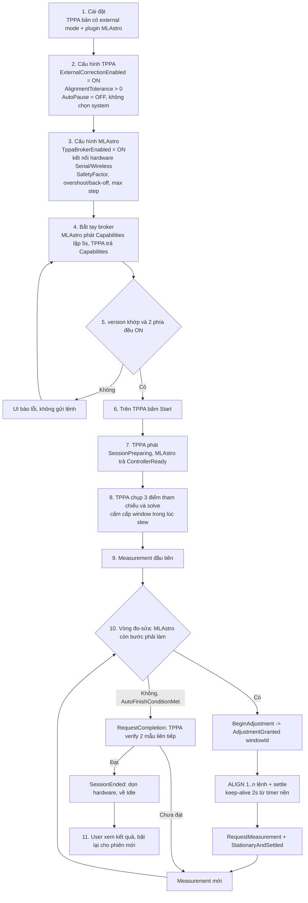
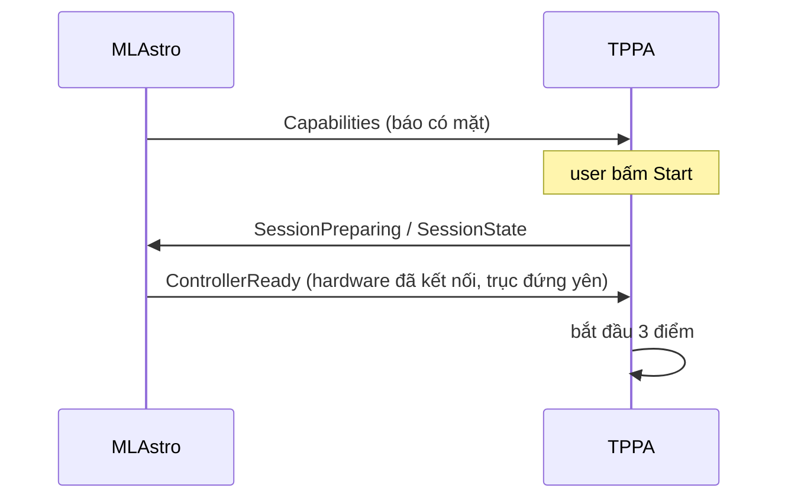
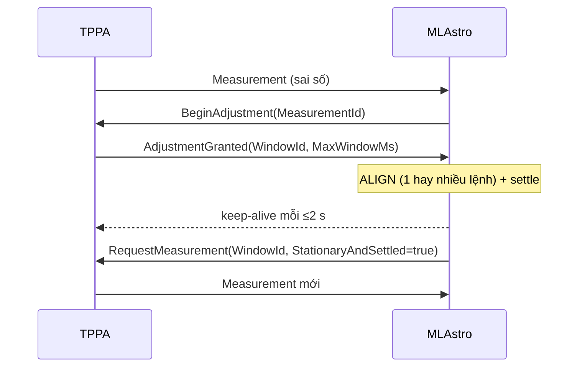

# PLAN v2 — MLAstro plugin (broker) ↔ TPPA

> **Thay thế** `newFeatureInstruction.md` (giữ lại chỉ để tham chiếu lịch sử).
> Chốt ngày 2026-09-24, sau phản hồi của tác giả TPPA.
> **Nguyên tắc làm việc**: trong nhánh fork ta **được tự do thêm biến/cờ/field** để mọi thứ đơn giản hơn; chỉ cần (a) mặc định OFF, (b) không đổi topic/message cũ, (c) không đụng OAPA/UPAS/Avalon. **PR gửi sau khi feature hoàn thiện**, không thương lượng interface trước.

---

## Trạng thái triển khai (2026-09-24)

**Đã code xong lớp broker 2 phía, build sạch, protocol test pass.** Chưa test end-to-end với camera/motor thật.

| Hạng mục | Trạng thái | Ghi chú |
|---|---|---|
| Hợp đồng §1 (topic, envelope, 14 Kind, payload) | ✅ | 2 phía giữ bản sao tên field; `Content` là JSON để không phải share assembly |
| TPPA: 7 setting mới + UI nhóm `External correction` (tab Settings) | ✅ | mặc định `ExternalCorrectionEnabled = false` |
| TPPA: publish `Measurement` (kể cả khi estimator unstable), `Capabilities`, `SessionState`, `SessionEnded` | ✅ | publish sau `AutoFinishGate` nên có `ToleranceReached` / `AutoFinishConditionMet` |
| TPPA: window + silence watchdog + heartbeat + keep-alive + trần thời gian phiên | ✅ | `ExternalCorrectionSession` (thuần protocol, không đụng camera) |
| TPPA: không auto-finish ở external mode, `MoveCloser` bị chặn khi có session | ✅ | |
| TPPA: `SimulatedExternalController` + 24 protocol test | ✅ | `ExternalCorrectionProtocolTest.cs`, không cần camera |
| TPPA: `docs/external-correction.md` | ✅ | hợp đồng đầy đủ + quy tắc an toàn |
| MLAstro: tab `SOFTWARE SETTING` + switch `TppaBrokerEnabled` (default ON) + log broker | ✅ | 4 tab: CONTROL / CONNECTION / CONFIGURATION / SOFTWARE SETTING |
| MLAstro: client (`TppaBrokerClient`), engine (`ExternalCorrectionEngine`), hardware (`HardwareAligner`), runner (`ExternalCorrectionRunner`) | ✅ | keep-alive từ timer nền; overshoot = vượt rồi back-off trong cùng window |
| MLAstro: khoá điều khiển tay khi TPPA đang chạy phiên | ✅ | `SessionActiveChanged` → `IsAutomatedAdjustment` |
| Chạy thật end-to-end (hội tụ dưới tolerance) | ⏳ | cần TPPA + camera + motor thật |
| Version bump + CHANGELOG cho cả 2 repo | ⏳ | chờ user chốt số version |

Các điểm **cố ý khác plan gốc** (đã chốt khi code):

1. `ExternalSilenceTimeoutSec` mặc định **15** (plan §2.1 ghi 10) — khớp §1.5.2 (`SilenceTimeoutMs = 15000`); code còn ép tối thiểu 3 nhịp heartbeat.
2. Thêm setting `ExternalReadyTimeoutSec` (30 s) — Q1-B cần con số này, plan ghi `[CẦN CHỐT: 30 s]`.
3. `RequestMeasurement` / `RequestCompletion` **tự đóng window** ngay khi TPPA nhận lệnh (không để vòng lặp tự đóng) — tránh window treo nếu caller quên.
4. `BeginAdjustment` lặp cùng `CommandId` → TPPA **phát lại** `AdjustmentGranted` cũ (idempotent theo §1.2) thay vì im lặng.
5. MLAstro làm **một lệnh ALIGN cho mỗi window** (overshoot + back-off là 2 lệnh trong cùng window), chưa làm chuỗi nhiều window.
6. Chưa làm: hiển thị trạng thái external trên UI TPPA (§2.5/PR2), `GetSessionState`, dữ liệu dec-spread.

---

## 0. Mục tiêu & phạm vi

**Yêu cầu gốc (user)**

1. Sửa TPPA để: (không chọn system, không bật `Do automated adjustment`) nhưng có chế độ **auto-continue** sau khi solve ra sai số.
   Nhấn Start → TPPA chụp 3 ảnh, solve, **gửi sai số qua broker** → khi bên ngoài báo đang sửa thì **tạm dừng chụp** → sửa xong thì tiếp tục lặp chụp 1 ảnh và gửi sai số mới.
2. MLAstro plugin:
   a. Loại bỏ thành phần TPPA khỏi plugin hiện tại; đưa các setting hiệu chỉnh sang MLAstro (tab `SOFTWARE SETTING`).
   b. Mở sẵn kết nối hardware (serial/wireless) + kết nối TPPA qua broker; nhận sai số → báo đang sửa → nudge Az/Alt → báo xong → chờ sai số tiếp theo.

**Phân chia trách nhiệm**

| | TPPA (fork upstream 2.2.7.0) | MLAstro plugin (tách ra) |
|---|---|---|
| Đo (3 điểm + vòng lặp 1 ảnh), plate solve, tính sai số, overlay | ✔ | |
| Session/camera/slew/guiding, cổng Start-Stop của TPPA | ✔ | |
| Chiến lược hiệu chỉnh (sign, safety factor, mode, overshoot, backlash) | | ✔ |
| Điều khiển hardware (COM/WebSocket) | | ✔ |
| UI riêng + vòng release riêng | ✔ | ✔ |

Không fork phần tính toán sai số. Không port `AutomatedAdjustmentController` (model học) — ta dùng công thức riêng.

**Phân biệt 2 khái niệm của TPPA (không lẫn trong code/PR)**

| Khái niệm | Vai trò | External mode |
|---|---|---|
| `ContinuousPolarErrorEstimator` | Ước lượng sai số còn lại từ plate solve mới (lấy sai số trước làm điểm đoán, phát hiện vượt target và đảo dấu) | **Vẫn chạy**, sinh số liệu `Measurement` |
| `AutomatedAdjustmentController` | Học đáp ứng hardware để chọn move/overshoot | **Không dùng** |

Bắt đầu tích hợp trên **legacy calculation mode**, chuyển continuous sau (không phải điều kiện tiên quyết).

---

### Workflow tổng — từ cài đặt đến vận hành

**Checklist cài đặt (theo thứ tự)**

1. Cài TPPA (bản có external mode) + plugin MLAstro; **không** cài bản TPPA cũ trùng identity.
2. TPPA: `ExternalCorrectionEnabled = ON`, `AlignmentTolerance > 0`, `AutoPause = OFF`, không chọn adjustment system, không bật `Do automated adjustments`.
3. MLAstro: `TppaBrokerEnabled = ON`, kết nối hardware (Serial/Wireless) + đặt `SafetyFactor`, overshoot (nếu dùng: **overshoot > tolerance**), max step, mode `Both`/`Auto`.
4. Kiểm tra dòng trạng thái `TPPA: vX sẵn sàng` trên UI MLAstro (bắt tay thành công).
5. Vận hành: bấm Start trên TPPA → 3 điểm → vòng đo–sửa tự động → kết quả cuối do TPPA xác nhận.

## 1. Hợp đồng broker v1

### 1.1 Topic (2 topic, phân biệt bằng `Kind`)

| Topic | Ai publish | Ai subscribe |
|---|---|---|
| `PolarAlignmentPlugin_PolarAlignment_ExternalEvent` | TPPA | MLAstro |
| `PolarAlignmentPlugin_PolarAlignment_ExternalCommand` | MLAstro | TPPA |

Giữ nguyên 4 topic cũ và 2 message cũ (`Progress`, `AlignmentError`) — không đổi contract cũ.

### 1.2 Envelope (mọi message)

`SessionId`, `CommandId`, `ReplyTo`, `SequenceNumber` (monotonic), `Kind`, `Version`, `IntendedRecipient`.
Trùng `CommandId` → trả lại reply cũ (idempotent). Request cũ/sai thứ tự → từ chối kèm mã (`StaleMeasurement`, `UnsupportedKind`, `VersionMismatch`, `Busy`).

### 1.3 Kind trong MVP

| Kind | Chiều | Field chính | Có sẵn trong TPPA? |
|---|---|---|---|
| `Capabilities` | TPPA → MLAstro | interface version, danh sách Kind, TPPA version, **giá trị heartbeat/silence-timeout/tolerance mặc định**, calculation mode | 🆕 message mới (version/tolerance đã có sẵn dữ liệu) |
| `Measurement` | TPPA → MLAstro | xem danh sách field có dấu ở dưới | 🆕 message mới — **phần lớn field dùng dữ liệu đã có sẵn** |
| `BeginAdjustment` | MLAstro → TPPA | `MeasurementId` | 🆕 |
| `AdjustmentGranted` | TPPA → MLAstro | `WindowId`, `MeasurementId`, `MaxWindowMs`, `SilenceTimeoutMs` | 🆕 |
| `RequestMeasurement` | MLAstro → TPPA | `WindowId`, `StationaryAndSettled=true` → TPPA đóng window + chụp lần mới | 🆕 |
| `RequestCompletion` | MLAstro → TPPA | yêu cầu verify/kết thúc (bất đồng bộ, xem §1.5) | 🆕 |
| `SessionState` | TPPA → MLAstro | state, `WindowId?`, `SamplesTaken`, `LastMeasurementId`, `ToleranceArcMin` | 🆕 (tolerance có sẵn) |
| `StopRequested` | TPPA → MLAstro | reason (user stop / sequence cancel / window closed / disconnect / silence timeout) | 🆕 |
| `Stopped` | MLAstro → TPPA | ack dừng, `HardwareStopStatus` (ok/unknown/fault) | 🆕 |
| `Fault` | MLAstro → TPPA | lý do, hardware stop status | 🆕 |
| `SessionEnded` | TPPA → MLAstro | reason, kết quả cuối (`Az/Alt/Total`), `ToleranceUsed`, `SamplesUsed`, `Achieved` | 🆕 (Az/Alt/Total có sẵn) |

**Field của `Measurement` — có sẵn hay phải bổ sung (kèm file:dòng)**

| Field | Nguồn trong TPPA 2.2.7.0 | Trạng thái |
|---|---|---|
| `AzimuthErrorDeg` / `AltitudeErrorDeg` / `TotalErrorDeg` | `TPAPAVM.PolarErrorDetermination.CurrentMountAxis{Azimuth,Altitude,Total}Error.Degree` — **đúng 3 giá trị đang publish trong `PolarAlignmentErrorMessage`** (`Instructions/PolarAlignment.cs:594`) | ✅ có sẵn |
| `AzimuthErrorArcMin` / `AltitudeErrorArcMin` | cùng object, đọc `.ArcMinutes` | ✅ có sẵn |
| `ToleranceArcMin` | `AlignmentTolerance` (property của sequence item + setting) | ✅ có sẵn |
| `ToleranceReached` | phép so sánh đã có: `Math.Abs(TotalError.ArcMinutes) <= AlignmentTolerance` (`:605`) | ✅ có sẵn (chỉ cần lộ ra) |
| `WouldFinishIfLegacy` | `AutoFinishGate.Register(belowTolerance)` **trả về bool** — chính là điều kiện finish (`Instructions/AutoFinishGate.cs`) | ✅ có sẵn (publish giá trị trả về) |
| `Status` | `Solve` success + `UpdateDetails` trả `estimateStable` (false = estimator unstable) | ✅ có sẵn 2 nguồn, cần gộp thành enum |
| `CalculationMode` | `UseContinuousErrorEstimator` | ✅ có sẵn |
| `AzDirection` / `AltDirection` | có logic sẵn nhưng là **chuỗi UI** (`CurrentMountAxis*ErrorDirection`, có emoji, phụ thuộc `Northern`) ⇒ **gửi enum** suy từ dấu error + cờ `Northern` (kèm `Northern` trong payload), **không** gửi chuỗi | ⚠️ có logic, phải chuyển enum |
| `MeasurementId`, `timestamp`, `IsFirstMeasurement`, `SessionId`, `WindowId`, `SampleIndex` | — | 🆕 mới (tầm thường) |

Hai chỗ phải sửa trong vòng lặp, không chỉ "thêm publish":

1. `PolarAlignmentErrorMessage` đang publish **trước** `autoFinishGate.Register(...)` (`:594` vs `:605`) ⇒ muốn có `ToleranceReached`/`WouldFinishIfLegacy` thì **publish `Measurement` sau `Register`** (hoặc thêm 1 publish riêng ngay sau).
2. Hiện khi `estimateStable == false` TPPA **im lặng** (`:644` chỉ log warning) và nhánh solve fail cũng không phát gì ⇒ ở external mode phải **vẫn publish** `Measurement(Status=Unstable)` để MLAstro không ngồi chờ vô hạn. (Lưu ý: `Solve()` retry vô hạn `while (!Success)` nên `SolveFailed` thực tế khó xảy ra — cần định nghĩa "capture/solve không tiến triển" bằng đếm số lần fail.)

**Thiết kế đã chọn**: mọi thao tác giữ chụp khoá theo **window có ID** (`WindowId` gắn với `MeasurementId`) — cho phép kiểm tra trùng/out-of-order và biết window đang cấp cho lần đo nào.

**Định nghĩa 2 cờ tolerance trong `Measurement`** (để MLAstro không phải tự đếm lại):

| Cờ | Định nghĩa | Ghi chú |
|---|---|---|
| `ToleranceReached` | **Lần đo này** có `TotalError` ≤ tolerance | Chỉ là thông tin của 1 mẫu, không đủ để kết thúc |
| `WouldFinishIfLegacy` (tên tạm — nên đổi thành `AutoFinishConditionMet`) | Điều kiện tự-kết-thúc của TPPA (2 lần liên tiếp ≤ tolerance, `AutoFinishGate`) **đã thoả** | Dùng để MLAstro mirror đúng policy của TPPA nếu muốn; "legacy" ở đây = "chế độ TPPA tự chạy", KHÔNG phải "legacy calculation mode" |

**Phân biệt hai việc khác nhau** (rất dễ lẫn):

- **Đóng window** (tạm ngừng chụp): TPPA **được phép** và **nên** đóng khi MLAstro im lặng quá `SilenceTimeoutMs` — đây là bảo vệ an toàn (plugin ta treo thì TPPA không bị kẹt), không phải "tự ý".
- **Kết thúc session** (finish): ở external mode TPPA **không được** kết thúc vì **giá trị sai số** (đạt tolerance / auto-finish). Chỉ kết thúc khi: MLAstro gọi `RequestCompletion` · bị cancel (`StopRequested` → `Stopped`) · hoặc hết **trần thời gian an toàn**.
- **Trần thời gian** (§1.5.7) phải đếm theo "thời gian chạy thật", **không tính lúc window đang mở** — nếu không, nó cũng cắt session giữa chuỗi giống như auto-finish.

### 1.4 Đơn vị & dấu (điểm dễ sai nhất)

- Gửi **cả độ và arcmin** để MLAstro khỏi tự đổi (tránh lệch làm tròn).
- Giá trị = đúng `PolarErrorDetermination.CurrentMountAxis{Azimuth,Altitude}Error.Degree` đang dùng cho UI/vòng lặp.
- Kèm `AzDirection`/`AltDirection` lấy từ `TPAPAVM.CurrentMountAxis{Azimuth,Altitude}ErrorDirection` (`TPAPAVM.cs:912-940`) → MLAstro **không** parse text UI, **không** tự suy dấu.
- `CalculationMode` chỉ để log/hiển thị, không đổi hành vi.

### 1.5 An toàn & vòng đời

1. **Window TTL = "im lặng tối đa"**, không phải tổng thời gian: `SilenceTimeoutMs` (mặc định 10 s). Vì lệnh ALIGN có thể tới 90 s + settle, chuỗi overshoot còn dài hơn ⇒ nếu đếm tổng thời gian thì TPPA sẽ chụp lại giữa lúc motor đang chạy (số liệu rác + lệnh sửa sai).
2. **Heartbeat 2 chiều** (phải THÊM MỚI — upstream 2.2.7.0 không có cơ chế keep-alive nào; chỉ có `Progress`/`AlignmentError` phát theo sự kiện):
   - TPPA → MLAstro: `SessionState` mỗi `HeartbeatMs = 2000`.
   - MLAstro → TPPA: keep-alive mỗi ≤ 2 s trong suốt lúc giữ window.
   - `SilenceTimeoutMs = 15000` (cho phép miss ~7 nhịp). Vượt ⇒ TPPA tự đóng window + `SessionState(reason=SilenceTimeout)`.
   - ⚠️ Keep-alive **phải phát từ timer/task nền độc lập**, KHÔNG phát trong luồng đang chờ lệnh ALIGN — vì 1 lệnh ALIGN block tới 90 s + settle, chuỗi overshoot → back-off có thể 3–5 phút.
3. **Không chụp/không slew khi window đang mở.** Không cấp window khi đang chụp hoặc đang slew (giai đoạn 3 điểm).
4. **Không tự finish ở external mode**: chỉ set `ToleranceReached` + `WouldFinishIfLegacy`; MLAstro tự quyết định dừng (để tái dùng đúng policy của TPPA nếu muốn).
5. **`RequestCompletion` là bất đồng bộ**: TPPA lấy mẫu xác nhận theo policy của nó (hiện là 2 lần liên tiếp ≤ tolerance), rồi phát `SessionEnded(Achieved, ToleranceUsed, SamplesUsed, kết quả cuối)`. Nếu chưa đạt thì trả `Achieved=false` + measurement mới để ta sửa tiếp.
6. **Mọi ack đều có hard timeout phía TPPA** — TPPA không bao giờ chờ vô hạn (`Stopped`, `BeginAdjustment`, `RequestMeasurement` đều có hạn). Hết hạn ⇒ TPPA tự xử lý và phát sự kiện tương ứng.
7. **Trần thời gian session (phải THÊM MỚI)** — upstream 2.2.7.0 **không có** `AutomatedAdjustmentTimeout`; vòng lặp chỉ có cảnh báo "quá 5 phút" rồi reset stopwatch (`Instructions/PolarAlignment.cs:623`) nên session có thể chạy vô hạn. ⇒ thêm setting mới `ExternalSessionTimeoutSec` (mặc định 30 phút), chỉ đếm **thời gian chạy thật**, không tính lúc window mở; hết hạn ⇒ `StopRequested(SessionTimeout)` → `Stopped` → `SessionEnded`.
8. Handler broker chỉ **queue rồi trả về ngay** (Publish của NINA `await` callback) — không `await` việc dài trong `OnMessageReceived`.

### 1.6 Mất session / khởi động lại

- MLAstro biến mất giữa session (crash/NINA restart): TPPA đóng window ngay khi vượt silence timeout, phát `SessionState(SilenceTimeout)`, rồi `SessionEnded(reason=ExternalLost)` sau grace 10 s. **Không** tự bật lại automation nội bộ.
- MLAstro khởi động lại: gửi `Capabilities` trước; nếu session cũ còn sống thì TPPA trả `SessionState` và ta tiếp tục, nếu đã `SessionEnded` thì bắt đầu session mới.
- TPPA bị Stop/Cancel (user, sequence skip, đóng cửa sổ): phát `StopRequested`, chờ `Stopped` **trong hạn**, rồi kết thúc bằng `SessionEnded`.

### 1.7 Ta không hardcode

Mọi giá trị (`HeartbeatMs`, `SilenceTimeoutMs`, max window, tolerance, interface version) phải đọc từ `Capabilities`. Thêm field mới: chỉ **thêm**, không đổi field cũ.

---

### 1.8 Ai so sánh tolerance — và các kịch bản kết thúc session

**Ai làm gì**

| Việc | Bên làm | Ghi chú |
|---|---|---|
| Giữ giá trị tolerance (setting) | TPPA | công bố qua `Capabilities` / `Measurement.ToleranceArcMin` |
| So sánh `TotalError` với tolerance cho **từng mẫu** | **TPPA** | phát `ToleranceReached` |
| Đếm số mẫu **liên tiếp** ≤ tolerance (policy 2 lần) | **TPPA** | phát `AutoFinishConditionMet` |
| Quyết định "xong rồi, chốt đi" | **MLAstro** | gọi `RequestCompletion` |
| Verify lần cuối + đóng session | **TPPA** | phát `SessionEnded` |
| Dùng tolerance để validate `overshoot > tolerance`, hiển thị/log, (tuỳ chọn) policy riêng | MLAstro | engine tự cài |

⇒ MLAstro **không phải làm lại phép so sánh** — chỉ đọc cờ. Nhưng MLAstro cần **giá trị** tolerance cho validate + UI.

**Các kịch bản kết thúc session**

| # | Kích hoạt | Ai khởi phát | Chuỗi message | Kết quả |
|---|---|---|---|---|
| 1 | Đã đủ tốt | MLAstro | `RequestCompletion` → TPPA verify → `SessionEnded(Achieved=true, ToleranceUsed, SamplesUsed)` | Kết thúc bình thường |
| 2 | Verify **không** đạt (mẫu xác nhận vượt tolerance / solve fail) | TPPA | trả `Measurement` mới với `Achieved=false` | **Không** kết thúc — MLAstro sửa tiếp |
| 3 | User Stop trên UI TPPA / đóng cửa sổ TPPA / sequence item bị skip | TPPA | `StopRequested(reason)` → `Stopped` → `SessionEnded(reason)` | Kết thúc, hardware status theo ack |
| 4 | MLAstro không ack Stop | TPPA | hết hard timeout → `SessionEnded(StopAckTimeout, hw=unknown)` | TPPA không bao giờ treo |
| 5 | MLAstro muốn dừng sớm (nút Stop / bỏ cuộc) | MLAstro | `Cancel`/`Stop` → TPPA `SessionEnded` | Kết thúc chủ động |
| 6 | MLAstro chết/treo giữa session | TPPA phát hiện | `SessionState(SilenceTimeout)` → đóng window → sau grace → `SessionEnded(ExternalLost)` | Kết thúc an toàn |
| 7 | MLAstro mất kết nối hardware | MLAstro | `Fault` → `SessionEnded(ControllerFault)` | Kết thúc + báo lỗi |
| 8 | TPPA không tiếp tục được (solve fail liên tiếp, camera/mount lỗi) | TPPA | `SessionEnded(CaptureFailed/...)` | Kết thúc |
| 9 | Trần thời gian an toàn (chỉ tính thời gian chạy thật) | TPPA | `StopRequested(SessionTimeout)` → `Stopped` → `SessionEnded` | Lưới an toàn cuối |
| 10 | Window hết hạn nhưng MLAstro vẫn sống | TPPA | đóng window + `SessionState` | **KHÔNG** kết thúc — chỉ mất quyền giữ chụp |
| 11 | Start session mới khi đang có session | TPPA | từ chối `Busy`, hoặc `SessionEnded(Superseded)` | Định nghĩa rõ, tránh 2 session |
| 12 | Tolerance đạt nhưng **không ai yêu cầu** | — | TPPA chỉ báo cờ, session **vẫn mở** | Chỉ kết thúc khi rơi vào #1/#3/#6/#9 |

**Điểm mấu chốt**: #12 chính là chỗ dễ mơ hồ — "đạt tolerance" **không phải** điều kiện kết thúc ở external mode; nó chỉ là điều kiện để MLAstro *quyết định* gọi `RequestCompletion`.

### 1.9 Ba mức "kết thúc" (rất dễ lẫn — đọc kỹ)

| Mức | Sự kiện phía MLAstro | Message gửi TPPA | TPPA làm gì |
|---|---|---|---|
| Kết thúc **1 bước sửa** | ALIGN xong + settle xong (một hay nhiều lệnh trong cùng window, kể cả overshoot rồi back-off) | `RequestMeasurement(WindowId, StationaryAndSettled=true)` | đóng window → chụp 1 ảnh → phát `Measurement` mới |
| **Đo lại mà không sửa** | muốn verify / kiểm tra lại / đo giữa chuỗi | `RequestMeasurement` (không cần `BeginAdjustment` trước) | chụp ngay → phát `Measurement` |
| Kết thúc **cả phiên** | TPPA báo `AutoFinishConditionMet=true` **và** MLAstro không còn bước nào chờ (không window đang mở, không kế hoạch sửa đang treo) — hoặc policy riêng chặt hơn của ta | `RequestCompletion` | verify lần cuối → `SessionEnded(Achieved=true/false, ...)`; nếu `false` thì **không** kết thúc, trả `Measurement` mới |
| Kết thúc **bất thường** | ta bỏ cuộc / user Stop phía MLAstro | `Cancel`/`Stop` | `SessionEnded` |
| | lỗi hardware / mất link | `Fault` | `SessionEnded(ControllerFault)` |

Quy tắc rút ra:

1. `AlignAll completed` = kết thúc **một bước** ⇒ gửi `RequestMeasurement`, **KHÔNG** phải `RequestCompletion`.
2. Trong **một window** có thể chạy **nhiều lệnh ALIGN** (overshoot → back-off); giữa các lệnh **chỉ** gửi keep-alive, không gửi gì khác; chỉ gửi `RequestMeasurement` khi ta *muốn TPPA đo*.
3. Mỗi phiên chỉ có **đúng một** `RequestCompletion`, ở lần cuối cùng.
4. `RequestMeasurement` không có window = hợp lệ (đo lại không sửa) — dùng cho verify/kiểm tra giữa chuỗi.
5. Quy ước đặt tên phía MLAstro để khỏi lẫn: `OnStepFinished()` → `RequestMeasurement`; `OnSessionFinished()` → `RequestCompletion`; `OnAbort()` → `Cancel`.
6. Chế độ auto-align **nội bộ** của MLAstro (dock CONTROL, tự sửa theo telemetry DMS) phải **tắt/không chạy** khi đang có session TPPA — tránh 2 bộ não cùng quay motor.

**Ai định nghĩa "đủ tốt"? Ba vai khác nhau**

| Vai | Bên | Giải thích |
|---|---|---|
| **Định nghĩa tiêu chí** (con số tolerance + đếm N lần liên tiếp) | **TPPA** | TPPA giữ setting tolerance, tự so sánh và phát cờ `ToleranceReached` / `AutoFinishConditionMet`. MLAstro **không** phải tự nghĩ ra tiêu chí. |
| **Kích hoạt chốt phiên** | **MLAstro** | Chỉ MLAstro biết nó còn bước nào (overshoot chưa back-off, ALIGN vừa gửi chưa đo, kế hoạch nhiều bước). TPPA không thấy được. |
| **Xác nhận + thực thi chốt** | **TPPA** | `RequestCompletion` → TPPA verify theo policy của nó (2 lần liên tiếp ≤ tolerance) → `SessionEnded`. |

Vì sao để MLAstro kích hoạt mà vẫn an toàn: **kích hoạt sớm không gây hại** — TPPA vẫn verify lại; nếu chưa đạt thì trả `Achieved=false` + `Measurement` mới và ta tiếp tục. Xấu nhất chỉ tốn 1 chu kỳ đo.

Ba lựa chọn cho điều kiện kích hoạt:

| Lựa chọn | Điều kiện | Ghi chú |
|---|---|---|
| **A (mặc định, khuyến nghị)** | `AutoFinishConditionMet == true` **và** không còn bước nào chờ | Giống hệt hành vi chế độ nội bộ của TPPA, không phải tự đếm |
| B (chặt hơn, tuỳ chọn) | tự đếm N lần liên tiếp ≤ tolerance (N do ta đặt), hoặc `Total ≤ 0.5 × tolerance`, hoặc yêu cầu **cả 2 trục** đều ≤ tolerance | Dùng giá trị có sẵn trong `Measurement` (`Az/Alt/Total` + `ToleranceArcMin`) — không cần TPPA thêm gì |
| C | chỉ do user bấm Stop | Không khuyến nghị: phiên chạy tới trần thời gian an toàn |

---

## 2. Workstream A — TPPA fork (nhánh `Feature-broker-for-RPA`)

### 2.1 Setting mới (mặc định OFF ⇒ an toàn khi merge)

| Setting | Mặc định | Ý nghĩa |
|---|---|---|
| `ExternalCorrectionEnabled` | false | Bật chế độ điều khiển ngoài |
| `ExternalAutoContinue` | true (khi bật external) | Tự chạy: 3 điểm → publish → chờ window → lặp 1 ảnh; **bỏ cổng "Press Start"** |
| `ExternalSilenceTimeoutSec` | 10 | Im lặng tối đa trước khi TPPA tự đóng window |
| `ExternalHeartbeatSec` | 2 | Chu kỳ `SessionState` |
| `ExternalGraceAfterSilenceSec` | 10 | Grace trước khi `SessionEnded(ExternalLost)` |

**Cờ nào bật/tắt trong external mode** (ai kích hoạt việc chụp)

| Setting | External mode | Tác dụng |
|---|---|---|
| `ExternalCorrectionEnabled` | **ON** — cờ DUY NHẤT phải bật (mặc định OFF) | Bật cả chế độ: publish `Measurement`, **chỉ chụp khi có `RequestMeasurement`**, không auto-finish, bật heartbeat/TTL, bỏ cổng chờ thủ công |
| `ExternalAutoContinue` | ON | Sau 3 điểm đi thẳng vào vòng chờ lệnh, **bỏ cổng "Press Start"** |
| `DoAutomatedAdjustments` | OFF (không chọn system) | Tắt `MoveCloser` — TPPA không tự sửa. **Không** liên quan tới việc chụp |
| `AutoPause` | OFF | Nếu ON: mỗi vòng TPPA tự `Pause()` và chờ user Resume — không hợp chế độ ngoài |
| `AlignmentTolerance` | > 0 | Dùng để phát `ToleranceReached` / `AutoFinishConditionMet`; = 0 thì 2 cờ này không bao giờ true (và `Validate()` cảnh báo) |
| `ExternalSessionTimeoutSec` | 1800 | Trần thời gian an toàn (chỉ đếm thời gian chạy thật) |

Ghi chú về bản upstream 2.2.7.0 (`Instructions/PolarAlignment.cs:575-645`):

- **Không có cổng "Press Start"** trong vòng lặp (cổng đó chỉ có ở bản fork merged của ta). Sau `UseImageCenterAsReference`, upstream vào ngay `do { WaitIfPaused → Solve(0) → publish → tolerance → MoveCloser → if (AutoPause) Pause() }`.
- Trong external mode **không có cờ nào làm TPPA tự chụp theo nhịp riêng** — nó chụp **chỉ** khi nhận `RequestMeasurement`. Đây chính là "chờ tự chụp để đo lại error".
- Muốn TPPA tự chụp định kỳ mà không cần ta yêu cầu là **chế độ khác** (poll tự động) — KHÔNG làm: dễ chụp chen vào lúc motor đang chạy.

### 2.2 Điểm hook (bản 2.2.7.0)

| File / vị trí | Việc phải làm |
|---|---|
| `Instructions/PolarAlignment.cs:594` (`Publish(PolarAlignmentErrorMessage)`) | Publish thêm `Measurement` cùng số liệu (giữ nguyên message cũ) |
| Ngay sau khi tạo xong `PolarErrorDetermination` (hết 3 điểm) | Publish `Measurement` đầu tiên, `IsFirstMeasurement=true` |
| Trong vòng lặp ngay trước `if (AutoPause)` (`:641`) | `await WaitForExternalMeasurementRequest(token)` — giữ không chụp trong lúc window mở; mở lại khi nhận `RequestMeasurement` hoặc khi silence timeout |
| `Instructions/PolarAlignment.cs:569` | External mode: bỏ yêu cầu system/`Connected` |
| `TPAPAVM.MoveCloser` (`TPAPAVM.cs:285`) | External mode ⇒ `return` sớm (không dùng `automatedAdjustmentController`) |
| `Instructions/AutoFinishGate.cs` | External mode: không tự kết thúc khi đạt tolerance; chỉ báo `ToleranceReached`/`WouldFinishIfLegacy` |
| `DockablePolarAlignmentVM` + sequence item | Subscribe `ExternalCommand`; **queue rồi trả về ngay** |
| Nơi xử lý cancel/teardown | Phát `StopRequested` / `SessionEnded` kèm lý do (kể cả sequence item bị skip) |

### 2.3 Không được đụng

OAPA/UPAS/Avalon, estimator, `AutomatedAdjustmentController`, message/topic cũ, UI ngoài 1 nhóm setting mới, branding/PluginId.

### 2.4 Test phía TPPA (`SimulatedExternalController`)

Chạy cho **cả 2 entry point** (dock tool + sequence instruction):

1. Chu kỳ cơ bản: 3 điểm → measurement → `BeginAdjustment` → `AdjustmentGranted` → `RequestMeasurement` → measurement mới.
2. `RequestMeasurement` quá muộn (vượt silence timeout) → `WindowExpired`/`SessionState`.
3. `RequestMeasurement` **trùng** cho cùng `WindowId` → idempotent (chỉ 1 lần chụp).
4. `RequestCompletion` trước và sau tolerance (kể cả khi đang mở window).
5. Cancel giữa window: `StopRequested` → `Stopped` ack; và case **không** ack (TPPA phải tự thoát theo hard timeout).
6. `SessionEnded` khi plugin ngoài chết giữa session (ExternalLost + grace).
7. Gửi Kind lạ / trùng `CommandId` / sai thứ tự / version lệch.
8. Đóng cửa sổ TPPA và skip sequence item giữa lúc window mở.
9. Trường hợp **move dài hợp lệ** (ví dụ 120 s): window **không** được tự đóng nhờ heartbeat.

### 2.5 Quy trình thu log estimator (không phải test case)

Nếu thấy sai số bất thường quanh overshoot: ghi lại TPPA version + settings + log có plate solve **trước/sau** overshoot → mở issue riêng cho tác giả. Không gộp vào PR broker, không block tiến độ.

---

## 3. Workstream B — MLAstro plugin

### 3.1 Tách repo

- **Bỏ**: `Instructions/**`, `Dockables/DockablePolarAlignmentVM.cs`, `TPAPAVM.cs`, `Vector3.cs`, `RefractionParameters.cs`, `Avalon/**`, `OAPA/**` (phần TPPA), `Converters/**` của overlay, `Options.xaml(.cs)` của TPPA.
- **Bỏ luôn phần mượn cổng**: `MLAstroLink.cs`, `SharedMlastroSerial.cs`, `IPolarAlignmentSystem*` (không còn ai tranh cổng COM).
- **Giữ**: `MLAstroRPA-navigation/**` (CONTROL / CONNECTION / CONFIGURATION), `MLAstroRPA-implement/Services/**` (Serial + WebSocket), resources/icon MLAstro.
- `PolarAlignmentPlugin.cs` → `MLAstroPlugin.cs`, **giữ `RootNamespace`** nhưng **cấp `PluginId` (GUID) MỚI** (`1352D162-…` giữ cho bản gộp MLAstroRPA+TPPA đã phát hành; trùng PluginId ⇒ NINA coi là cùng plugin — quyết định 2026-09-25). Hệ quả: settings MLAstro theo GUID cũ phải cấu hình lại; đổi `AssemblyName` phải sửa đồng bộ pack URI.
- Driver rút gọn thành **`HardwareAligner`**: `AlignBothAxes(azArcMin, altArcMin)`, `NudgeAz`, `NudgeAlt`, `Abort`, `GetStatus` — tái dùng `MoveBothAxes`/`RunAlignMove` (ack `ok` → poll `?` tới `READY`/`ALIGN_COMPLETED`, timeout 90 s).

### 3.2 Tab `SOFTWARE SETTING`

| Setting trên hình | Nguồn mới | Ai dùng |
|---|---|---|
| Correction axis mode | MLAstro | `Both` = 1 lệnh ALIGN 2 trục; `Auto` = trục sai số lớn hơn |
| Automated adjustment timeout | MLAstro | Trần thời gian vòng sửa |
| Reverse Azimuth / Altitude Axis | MLAstro (đã có) | Đảo dấu trước khi gửi firmware |
| Azimuth backlash compensation | MLAstro | Bù backlash trục Az |
| Correction Safety Factor | MLAstro (75%) | Nhân vào arcmin |
| Enable overshoot / Up / Down (+arcmin) | MLAstro | Cộng vượt target rồi quay lại (nhiều lần đo trong 1 window) |
| Do automated adjustments | **không cần** | Thay bằng 1 checkbox "External correction (TPPA broker)" |

### 3.3 Correction engine

1. Nhận `Measurement` valid → log + hiển thị.
2. `BeginAdjustment(MeasurementId)` → nhận `AdjustmentGranted(WindowId)`.
3. Tính lệnh: `arcMin = ErrorArcMin × sign(direction) × SafetyFactor` (+ overshoot khi bật cho hướng hiện tại); `Both` ⇒ 1 lệnh; `Auto` ⇒ trục lớn hơn. Kẹp **max step** an toàn.
   - **Validate: khi bật overshoot thì `overshoot > tolerance`** (lấy `ToleranceArcMin` từ `Capabilities`/`Measurement`); nếu không thoả ⇒ cảnh báo UI + log. Lý do: ở đỉnh overshoot sai số ≈ overshoot, nên phải **lớn hơn** tolerance để không có lần đo "đã đạt" nằm giữa chuỗi.
   - Đây là **guard bổ sung của engine**, KHÔNG thay thế rule protocol ở §1.3/§1.5 — vì nó chỉ bảo vệ bước overshoot, không bảo vệ bước back-off (backlash/stiction có thể để residual nhỏ tuỳ ý), không dùng được khi tolerance lớn hơn step nhỏ nhất, và không có giá trị nào khi solve fail/unstable.
4. Gửi keep-alive (≤ 2 s) trong suốt lúc move + settle → tránh silence timeout.
5. `RequestMeasurement(WindowId, StationaryAndSettled=true)`.
6. Đạt điều kiện dừng (N lần liên tiếp ≤ tolerance, N cấu hình) → `RequestCompletion` → nhận `SessionEnded` → dọn hardware.
7. Lỗi (timeout/mất link/motor fault) → `Fault` + đóng session; tự reconnect ở lần chạy sau.

**Bước sửa dài — xử lý riêng**

- Keep-alive vẫn chạy từ timer nền, không bị chặn bởi `AlignBothAxes`.
- Log mỗi lệnh ALIGN: TX, ack, thời lượng, kết quả — để chẩn đoán khi một bước kéo dài bất thường.
- UI MLAstro: hiện "đang sửa — TPPA đang giữ window" + đồng hồ đếm. UI TPPA: hiện "đang chờ bộ điều khiển ngoài (Xs)" để người dùng không tưởng TPPA treo.
- Vượt ngưỡng cảnh báo (ví dụ 5 phút cho 1 bước) ⇒ log warning; vẫn giữ window miễn còn keep-alive.

### 3.4 Hardware link

Kết nối sẵn serial/wireless (watchdog + stale-serial takeover đã có ở firmware). TPPA không mở cổng nữa ⇒ bỏ `BeginExternalControl`/`PauseQueryGlobal`; MLAstro poll `?` suốt session.

### 3.5 Broker client (state machine)

`Idle → Capabilities → WaitingMeasurement → MoveRequested(BeginAdjustment) → Adjusting(window) → RequestMeasurement → WaitingMeasurement → … → Completing(RequestCompletion) → Ended`. Mọi nhánh lỗi → `Fault` + `Ended`. Có timeout riêng cho từng transition.

---

### 3.6 Switch bắt tay với TPPA (yêu cầu phía MLAstro)

- Setting `TppaBrokerEnabled` (switch, **mặc định ON**, ở tab `SOFTWARE SETTING`): bật/tắt toàn bộ tích hợp broker.
- Khi **ON**:
  - publish `Capabilities` lúc khởi động và **lặp mỗi 5 s cho tới khi có reply** (TPPA có thể load sau MLAstro).
  - subscribe `ExternalEvent`; kiểm tra interface version — không hợp lệ ⇒ hiện "TPPA không tương thích (vX)" và **không** gửi lệnh nào.
  - kết nối hardware sẵn → vào state machine §3.5 ở trạng thái Idle.
  - hiện trạng thái trên UI: `TPPA: off / chưa thấy / vX sẵn sàng / đang phiên (WindowId)`.
- Khi **OFF**: huỷ subscribe, bỏ qua mọi event; nếu đang có phiên ⇒ gửi `Cancel` + chờ `Stopped` trước khi tắt; trả điều khiển về chế độ thủ công / auto-align nội bộ.
- **Điều kiện 2 phía**: phải bật cả `TppaBrokerEnabled` (MLAstro) **và** `ExternalCorrectionEnabled` (TPPA). TPPA chưa bật ⇒ không có reply `Capabilities` ⇒ MLAstro hiện "TPPA chưa bật chế độ external" (không spam log).
- Không cho tắt switch giữa lúc đang giữ window (tắt = tự `Cancel` + chờ `Stopped`).

## 3b. Kịch bản cho từng quy trình (ID dùng luôn cho test)

> Góc nhìn "ai kết thúc session" ở §1.8; đây là góc nhìn **theo từng quy trình**, kèm ID để test tham chiếu (`Q1-A`, `Q3-B`, ...).
> Nhãn `[CẦN CHỐT]` = quyết định do ta tự đặt, ghi ra để review.

### Q1 — Kết nối & bắt đầu phiên

| ID | Kịch bản | Điều kiện | Chuỗi message | Kết quả |
|---|---|---|---|---|
| Q1-A | Bình thường | MLAstro online, hardware OK | `Capabilities` → (Start) `SessionPreparing` → `ControllerReady` | 3 điểm bắt đầu |
| Q1-B | TPPA Start khi MLAstro **chưa** online | — | `SessionPreparing` rồi chờ | Hết `ReadyTimeoutSec` `[CẦN CHỐT: 30 s]` ⇒ `SessionEnded(NoControllerReady)` + toast. **Không** tự chạy chế độ nội bộ |
| Q1-C | MLAstro online trước, chưa có session | — | `Capabilities` | Idle, chờ `SessionPreparing`/`Measurement` |
| Q1-D | Hardware kết nối thất bại lúc bắt đầu | COM/WS lỗi | `Fault` | Nếu đã có session: `SessionEnded(ControllerFault)`; nếu chưa: không bao giờ `ControllerReady` ⇒ Q1-B |
| Q1-E | Start session mới khi đang có session | double Start | từ chối `Busy` | Session cũ giữ nguyên |
| Q1-F | Thiếu điều kiện (camera/mount chưa connect, tolerance = 0) | — | — | TPPA chặn Start như hành vi hiện tại (không đổi) |

### Q2 — Ba điểm tham chiếu

| ID | Kịch bản | Điều kiện | Chuỗi message | Kết quả |
|---|---|---|---|---|
| Q2-A | Bình thường | — | `Measurement(IsFirstMeasurement=true)` | Vào vòng đo–sửa |
| Q2-B | Solve fail ở một điểm | — | — | TPPA retry (hành vi hiện có); fail liên tục quá ngưỡng ⇒ `SessionEnded(CaptureFailed)` |
| Q2-C | Cancel giữa 3 điểm | user Stop / skip sequence | `StopRequested` → `Stopped` → `SessionEnded` | §1.8 #3 |
| Q2-D | MLAstro im lặng suốt giai đoạn này | — | — | **Không sao** — TPPA không cần gì; nhưng **cấm cấp window** trong lúc slew |
| Q2-E | MLAstro đang quay motor khi TPPA bắt đầu | user thao tác tay trên dock | — | Trục phải đứng yên khi đo ⇒ **khoá điều khiển tay của MLAstro khi session TPPA chạy** `[CẦN CHỐT]` |

### Q3 — Một bước sửa (quy trình chính)

| ID | Kịch bản | Điều kiện | Chuỗi message | Kết quả |
|---|---|---|---|---|
| Q3-A | Bình thường, 1 lệnh | — | như sơ đồ trên | Đo lại |
| Q3-B | Nhiều lệnh trong 1 window (overshoot → back-off) | overshoot bật | chỉ keep-alive giữa các lệnh | Đo ở cuối chuỗi |
| Q3-C | Muốn đo **giữa** chuỗi (kiểm tra overshoot) | — | `RequestMeasurement` (đóng window) → đo → `BeginAdjustment` lại (window mới) `[CẦN CHỐT]` | Vẫn đúng vì window có ID |
| Q3-D | Mẫu mới `Status ≠ Valid` (solve fail/unstable) | — | — | MLAstro **không** tính lệnh; xin đo lại; lặp quá N lần ⇒ `Cancel` |
| Q3-E | ALIGN timeout 90 s / không có `ALIGN_COMPLETED` | hardware treo | `Abort()` → nếu vẫn lỗi: `Fault` | `SessionEnded(ControllerFault)` |
| Q3-F | Firmware chặn move (softlimit/limit) | — | `Fault` | End + báo lỗi rõ |
| Q3-G | Window hết hạn vì mất keep-alive (treo ngắn) | GPU/GC/IO pause | `SessionState(SilenceTimeout)` | TPPA đã chụp **trong lúc motor đang chạy** ⇒ mẫu rác. **MLAstro phải lọc mẫu có timestamp nằm trong lúc đang move** rồi `RequestMeasurement` lại (không sửa) |
| Q3-H | Sai số tăng sau khi sửa (sai dấu) | — | — | Đảo dấu, chạy tiếp; nếu tệ hơn ngưỡng ⇒ giảm step / `Cancel` |
| Q3-I | User Stop giữa lúc sửa | — | §1.8 #3 | End, motor dừng |

### Q4 — Verify & kết thúc phiên

| ID | Kịch bản | Điều kiện | Chuỗi message | Kết quả |
|---|---|---|---|---|
| Q4-A | Bình thường | `AutoFinishConditionMet` + hết bước chờ | `RequestCompletion` → TPPA verify 2 mẫu → `SessionEnded(Achieved=true)` | Kết thúc, hiện kết quả cuối |
| Q4-B | Verify **không** đạt | mẫu xác nhận vượt tolerance | `Achieved=false` + `Measurement` mới | Quay lại Q3 |
| Q4-C | Verify gặp solve fail liên tục | — | — | `SessionEnded(CaptureFailed)` `[CẦN CHỐT]` |
| Q4-D | `RequestCompletion` khi đang mở window | — | — | TPPA **tự đóng window rồi verify** `[CẦN CHỐT]` (thay vì reject) |
| Q4-E | User Stop trong lúc verify | — | §1.8 #3 | End |

### Q5 — Dừng / ngắt

| ID | Kịch bản | Nguồn | Chuỗi message |
|---|---|---|---|
| Q5-A | Stop từ UI TPPA | TPPA | `StopRequested` → `Stopped` → `SessionEnded` |
| Q5-B | Đóng cửa sổ TPPA | TPPA | như Q5-A |
| Q5-C | Sequence item bị skip / sequence abort | TPPA | như Q5-A |
| Q5-D | Stop từ UI MLAstro | MLAstro | `Cancel`/`Stop` → `SessionEnded` |
| Q5-E | MLAstro không ack Stop | TPPA | hard timeout → `SessionEnded(StopAckTimeout, hw=unknown)` |

### Q6 — Sự cố / mất session

| ID | Kịch bản | Phát hiện bởi | Chuỗi message / xử lý |
|---|---|---|---|
| Q6-A | MLAstro crash/treo | TPPA | silence > 10 s ⇒ đóng window → grace 10 s ⇒ `SessionEnded(ExternalLost)` |
| Q6-B | Mất link hardware tạm thời | MLAstro | tự thử reconnect ≤ 10 s, vẫn gửi keep-alive; vượt hạn ⇒ `Fault` `[CẦN CHỐT]` |
| Q6-C | Mất link vĩnh viễn (rút cáp, ESP32 reset) | MLAstro | `Fault(HardwareStopStatus=unknown)` ⇒ `SessionEnded(ControllerFault)` |
| Q6-D | TPPA mất camera/mount | TPPA | `SessionEnded(CaptureFailed/...)` |
| Q6-E | Vượt trần thời gian session | TPPA | `StopRequested(SessionTimeout)` → `Stopped` → `SessionEnded` |

### Q7 — Chạy lại / phiên mới

| ID | Kịch bản | Xử lý |
|---|---|---|
| Q7-A | Sau `SessionEnded`, user Start lại | MLAstro dọn hardware, về Idle, handshake lại (`Capabilities`) rồi Q1 |
| Q7-B | MLAstro restart (NINA vẫn chạy) | gửi `Capabilities`; nếu TPPA còn session ⇒ nhận `SessionState` và tiếp tục, nếu đã end ⇒ Idle |
| Q7-C | TPPA teardown (NINA shutdown) | phát `SessionEnded` (nếu đang chạy); MLAstro dừng motor + dọn |

---

## 4. Ràng buộc thiết kế (đã chốt)

1. **Không** port `AutomatedAdjustmentController` (model học) sang MLAstro.
2. **Không** đưa thay đổi estimator (hay đổi mode mặc định) vào PR broker — là issue riêng khi có log.
3. **Không** làm cơ chế gia hạn window nhiều bước — heartbeat thay thế.
4. **Không** chấp nhận TPPA chờ ack vô hạn, cũng không để TPPA tự kết thúc im lặng — mọi kết thúc phải có `SessionState`/`SessionEnded` + lý do.
5. **Không** để TPPA tự finish khi đạt tolerance ở external mode.
6. **Không** làm chế độ TPPA tự chụp định kỳ (poll) — chỉ chụp theo `RequestMeasurement` (giữ nguyên thiết kế hiện tại).

---

## 5. Lộ trình

| Mốc | Nội dung | Done khi |
|---|---|---|
| M0 | Đóng băng hợp đồng §1 + `docs/external-correction.md` (kèm ví dụ payload) | doc review xong |
| M1 | **PR1 — TPPA fork**: 5 setting + publish `Measurement` + window + `RequestMeasurement` + `RequestCompletion` + cancel path + `Capabilities` | `SimulatedExternalController` pass 9 case ở §2.4 |
| M2 | MLAstro plugin tách xong (build Release sạch, tab `SOFTWARE SETTING`) | chạy độc lập, không còn tham chiếu TPPA |
| M3 | Broker client + correction engine + hardware | chạy thật hội tụ dưới tolerance |
| M4 | Hardening: silence/session-lost/grace/reconnect/log tương quan | test rút cáp, kill plugin, Stop giữa chừng |
| M5 | PR1 gửi upstream sau khi feature hoàn thiện + PR2 (mở rộng) + release nội bộ | PR mở, docs+test kèm theo |

**PR1** = basic cycle + cancellation + completion + capabilities + docs + test (không gồm overshoot nâng cao, không gồm estimator).
**PR2** = dữ liệu hợp lệ (dec-spread/stability), `GetSessionState`, hiển thị trạng thái external trên UI TPPA.

---

## 6. Rủi ro

| Rủi ro | Xử lý |
|---|---|
| Merge chậm (dự án 1 maintainer) | Coi fork là dependency chạy được; không để release MLAstro phụ thuộc thời điểm merge |
| TPPA tự kết thúc giữa chuỗi overshoot | §1.5.5 + §1.5.7 đo theo thời gian chạy thật |
| Đóng window giữa lúc motor chạy | §1.5.1 silence-based TTL + keep-alive §3.3.4 |
| Sai dấu/hướng | Dùng đúng `AzDirection`/`AltDirection` của TPPA, không tự suy (§1.4) |
| Plugin ngoài chết giữa session | §1.6 silence + grace + `SessionEnded(ExternalLost)` |
| Phát hành fork cho user khi PR chưa merge | Không phát hành; trùng plugin identity ⇒ 2 TPPA trong NINA |

---

## 7. Việc cần chốt nội bộ (không bàn với tác giả)

1. Số lần liên tiếp ≤ tolerance để ta gọi `RequestCompletion` (mặc định 2, khớp policy TPPA).
2. Max step mỗi lần sửa (kẹp an toàn) — đề xuất 60 arcmin/lần trừ khi user override.
3. Tên assembly/plugin mới của MLAstro (giữ `PluginId` cũ).
